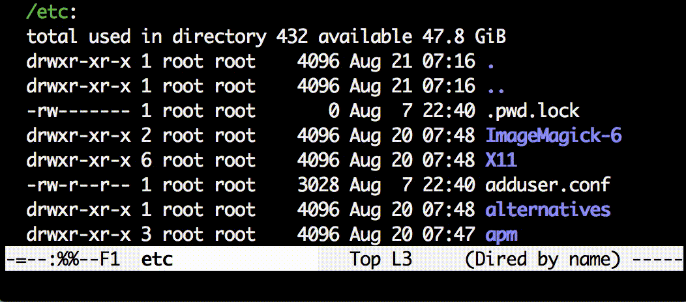

fuzzy-finder.el
===============

Fuzzy Finder App Integration into Emacs

Overview
--------

`fuzzy-finder` command opens a new window, starts a fuzzy finder
process inside of it, and then calls a function with selected items.
By default it visits selected files.

There are a number of applications which can be used with `fuzzy-finder`,
including [fzf][] (default), [peco], and [selecta][].

Compared to Other Selector Frameworks (like Helm, Ivy...)
---------------------------------------------------------

There are several Emacs frameworks for selecting items that purely (or mostly)
implemented in Emacs-Lisp.
For most cases these frameworks is better suited than this package, for example
selecting command for `M-x`, opening files from recentf list, or looking for
a function help.

However, this package has one big advantage which these frameworks do not
provide: you can start querying and selecting items *before* the input list has
been completed.
You will feel the power of this feature when you start `fuzzy-finder` in
your home directory.

Available Commands
------------------

### `fuzzy-finder`

Open a new window and start a fuzzy finder process inside of it.
This package defines several variables that configures this command:
for example `fuzzy-finder-default-command` defines what command is executed
for fuzzy finder process.

Without any configuration, it lists up all files in the current directory and
child directories, start a `fzf` process, and then visit selected files.

This command can also be used as a function to define a new fuzzy finder command.
You can pass keyword arguments to overwrite configurations defined by the
variables.

### `fuzzy-finder-find-files-projectile`

Execute fuzzy finder and visit resulting files.

If projectile package is available and root directory is found, start from that
directory.

### `fuzzy-finder-goto-gitgrep-line`

Select lines with fuzzy finder and go to selected point in a git repository.

Run git grep command to generate input lines.

License
-------

This software is licensed under GPL version 3 or any later version.
See `LICENSE` for details.

[fzf]: https://github.com/junegunn/fzf
[peco]: https://github.com/lestrrat/peco
[selecta]: https://github.com/garybernhardt/selecta
